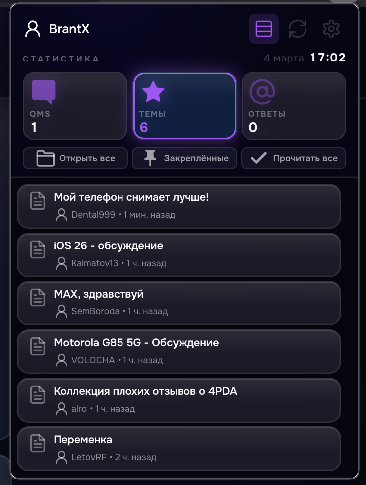
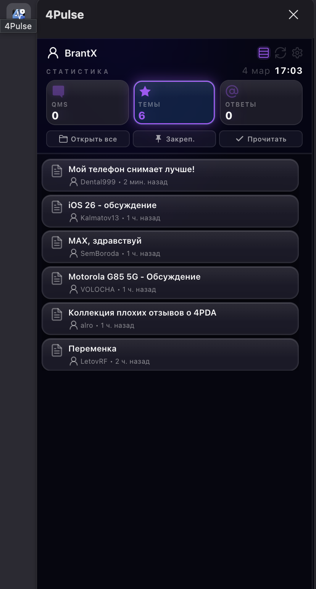

## Screenshots

  
  

# 🚀 4Pulse: The Ultimate 4PDA Experience
[🇷🇺 Описание на русском языке ниже](#-4pulse-профессиональный-инструмент-для-4pda)

**4Pulse** is a powerful, modern Firefox extension designed to revolutionize how you interact with the 4PDA forum. It combines deep functionality with a stunning "Liquid Glass" aesthetic for the 2026 web.

### 💎 Key Features:
* **Liquid Glass UI** — Ultra-modern frosted glass interface with adaptive gradients.
* **Inline Chat** — Reply to QMS and forum threads directly within the extension popup.
* **Firefox Sidebar Support** — Keep your forum life accessible in a persistent side panel.
* **Focus / Priority Mode** — Highlight essential threads and cut through the noise.
* **Mute Mode** — Silence specific threads with one click to stay productive.
* **Typography & Fonts** — Huge selection of curated fonts with perfect Cyrillic support (Onest, Inter, Manrope, etc.).
* **Multilingual** — Full interface localization for global users.
* **Built-in Radio** — Your favorite background soundtrack while browsing.

---

# 🚀 4Pulse: Профессиональный инструмент для 4PDA

**4Pulse** — это современное расширение для Firefox, превращающее работу с форумом 4PDA в технологичное удовольствие. Наследник идей 4PDA Live, полностью переосмысленный для 2026 года.

### ✨ Основные возможности:
* **💎 Liquid Glass UI** — интерфейс с эффектом матового стекла и адаптивными переливами.
* **💬 Инлайн-чат** — общайтесь в QMS и темах прямо в окне расширения.
* **🖥 Поддержка Sidebar** — полноценная работа через боковую панель браузера.
* **🎯 Режим концентрации (Focus/Priority)** — выделяйте важные темы и скрывайте лишнее.
* **🔇 Тихий режим (Mute)** — мгновенно заглушайте уведомления от отдельных веток.
* **🔤 Современная типографика** — огромный выбор шрифтов с идеальной кириллицей (Onest, Inter, Manrope).
* **🌍 Мультиязычность** — полная локализация интерфейса.
* **📻 Встроенное Радио** — любимая музыка всегда под рукой.

---
### 🛠 Installation / Установка
1. Clone the repository / Клонируйте репозиторий: `git clone https://github.com/BrantX-dev/4Pulse.git`
2. Load in Firefox via `about:debugging`. / Загрузите в Firefox через `about:debugging`.
